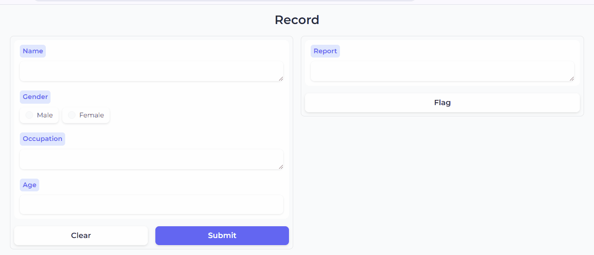
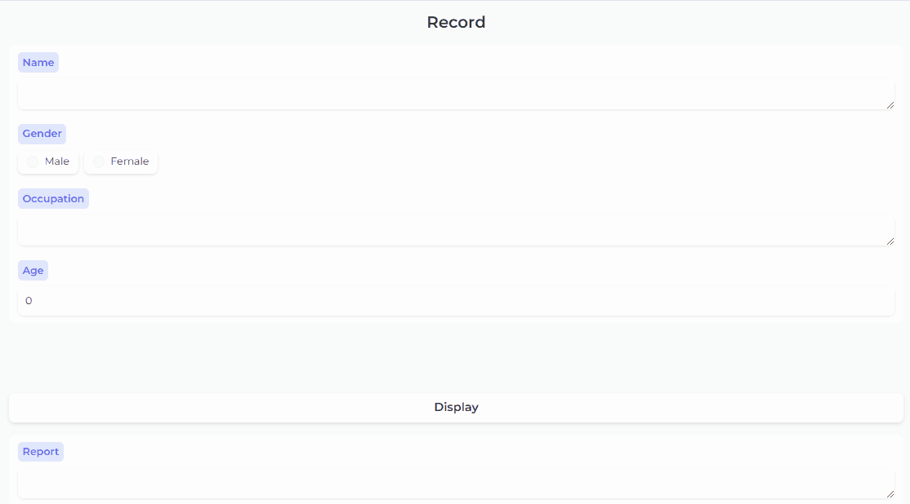

# Gradio-in-R 😎
The goal of this repository is to show R users how to easily use [Gradio](https://www.gradio.app/docs) in their R projects. Gradio is a popular Python module that allows you to quickly turn your Python code into a web application, with an easy-to-use API. 

Thankfully, with the aid of [reticulate](https://rstudio.github.io/reticulate/) R package, you can easily port Python modules into R and use them in your R projects. Here are 2 examples of how to quickly build a gradio interface for your R code. 

## **Simple Interface** 🧮
To begin, you will need to install reticulate, if you haven't done so already. In your R console, run:

`install.packages("reticulate")`

Now, load the package in your R script:

`library(reticulate)`

Next, install the Python gradio module:

`py_install("gradio", pip = TRUE)`

Import the gradio module

`gr <- import("gradio)`

After running the above import code, `gr` becomes an object containing all the gradio methods you need to build a gradio app. That line of code is equivalent to `import gradio as gr` in Python. 

To access a method in R, we use the `$` operator. Now, let us write a simple R function that prints out a statement using the input arguments of the function:

```
# write function
record <- \(name,gender,occupation,age){

  gender = tolower(gender)

  if(gender == "male"){
    return(paste(name, "is", glue::glue(age,","), "and he is a", occupation))
  } else if(gender == "female"){
    return(paste(name, "is", glue::glue(age,","), "and she is a", occupation))
  }

}

# run function
record(name = "Melissa James",
      gender = "Female",
      occupation = "Designer",
      age = 23)

[1] Melissa James is 23, and she is a Designer
```
Great! Now, let us build a simple gradio interface for the application:

```
gr_app <- gr$Interface(record,
  inputs = c(gr$Text(label = "Name"),
             gr$Radio(label = "Gender", choices = c("Male","Female"),value = c("Male","Female")),
             gr$Text(label = "Occupation"),
             gr$Number(label = "Age")),
  outputs = gr$Text(label = "Report"),
  title = "Record",
  theme = gr$themes$Soft()
)
```
If you build gradio apps in Python, you would immediately notice the similarity in syntax, and that will help you quickly get a hang of its usage in R.

With the gradio interface built, you can launch the application:

```
gr_app$launch(server_name = "localhost",server_port = as.integer(4000))
```
After running that line of code, open your browser and enter the url `localhost:4000`, and your gradio app will be loaded.



Unlike in Python, however, in order to launch the gradio app in R, you will need to manually define the server name and port in the `launch()` function. 

In order to learn more about building simple gradio interfaces, you can take a look at the official gradio documentation [here](https://www.gradio.app/docs/gradio/interface). Even if you are not a Pythoneer or Pythonista, the doc and the examples therein are very easy to understand. Do not fret! 😄

Let's now see another way to build gradio apps, this time with blocks.

## **Blocks Interface** 🤓
Gradio blocks allow you to be more creative with the user interface of your application by building your application with blocks. For example, you can align your widgets (or components, as they are called in the gradio community) vertically or horizontally. Here is a simple example of building with blocks using the same R function as above:

```
app <- gr$Blocks(theme = gr$themes$Soft())

with(app,{
  gr$Markdown("<center><h2><strong>Record</strong></h2></center>")

  # define the input widgets, which correspond to the arguments of the R function
  name <- gr$Text(label = "Name")
  gender <- gr$Radio(label = "Gender", choices = c("Male","Female"),value = c("Male","Female"))
  occupation <- gr$Text(label = "Occupation")
  age <- gr$Number(label = "Age")

  # pass the input widgets as a row
  gr$Row(name,gender,occupation,age)

  # define the button object
  button <- gr$Button("Display")

  # define the output object and pass it as a column
  output <- gr$Text(label = "Report")
  gr$Column(output)

  # pass the R function to the button-click method along with the inputs and outputs
  button$click(
    fn = record,
    inputs = list(name,gender,occupation,age),
    outputs = output
  )
})
```
Launch the application:

```
app$launch(server_name = "localhost", server_port = as.integer(4000))
```
Again, enter `localhost:4000` in your browser url, and your gradio application will be loaded.



Building with gradio blocks is more advanced than building with a simple interface. Nevertheless, it is not as complex as it may seem. 

If you are an R developer who is entirely new to gradio, it would be best to build a few applications with a simple interface before you venture into building with blocks. Nevertheless, if you want to learn more about gradio blocks, take a look [here](https://www.gradio.app/docs/gradio/blocks).

## **Deploying App** 🚀
Gradio apps built in Python can be easily deployed on [Hugging Face](https://huggingface.co/) as a space and accessed via a dedicated url. Nevertheless, in R, the most plausible way to deploy a gradio app will be through [Docker](https://www.docker.com/). That's a to-do for this repo. 

However, in the meantime, R gradio apps can be shared with colleagues and collaborators by exposing `localhost:4000` to the internet using [Ngrok](https://ngrok.com/). After downloading and setting up Ngrok on your machine, to share your gradio app, launch your application, then in your terminal run this:

```
ngrok http http://localhost:4000/
```
Ngrok will generate a random url for your application, which you can share with others for as long as the app server runs on your machine. You can take a look at this [post](https://ifeanyidiaye.medium.com/how-to-expose-your-local-host-to-the-internet-be6492f5957d) to help you get started with Ngrok on Windows, especially the setting up part.

## **Wrapping Up**
While [R/Shiny](https://shiny.posit.co/) remains the go-to framework for building web applications in R, gradio can help with fast prototyping, and it can also be integrated into an R/Shiny project using the [gradio Python client](https://www.gradio.app/guides/getting-started-with-the-python-client). You can take a look at this [repository](https://github.com/Ifeanyi55/StoryMaker) to see how that can be implemented. 

Over time, more R gradio app examples, as code, will be added to this repository to explore the versatility and different use cases of gradio, all while coding in R. 

If you would like to see an example of a gradio app built for a machine learning regression model, take a look inside the `Code` folder. Download the script and run it in your R editor or IDE. You may also download the trained model on your computer to run the gradio app if you do not wish to train the model afresh.

## **Contributing**
If you would like to contribute to this repository, here are ways you can do that:
- Raise an issue, if you find one
- Contribute your R gradio projects
- Suggest example R gradio projects


